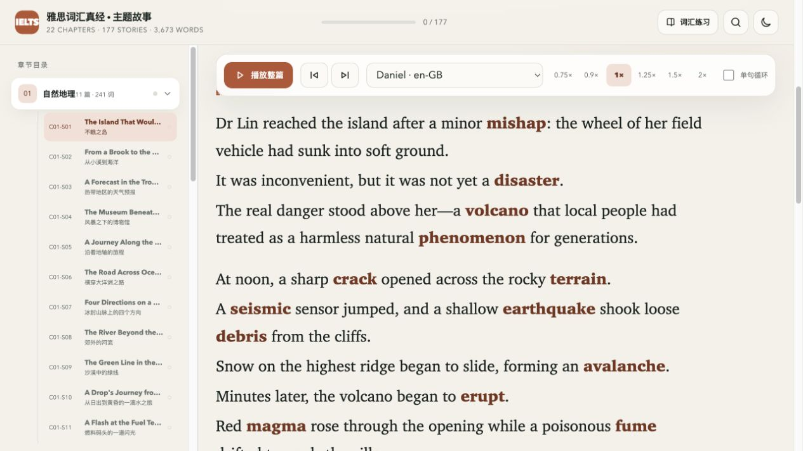

# 雅思词汇真经：轮次背词与主题故事

**一轮轮找出记不住的词，再到短篇故事里理解它们。**

围绕《雅思词汇真经》章节词表做的个人学习工具：22 个主题章节、3673 个词条，以及 177 篇主题短篇故事。你可以只刷闪卡，也可以只读故事，或把两种练习配合起来。

## 界面演示

**先回忆，再翻牌。** 选择章节，用“未想出来”和“认识”记录每次反应，逐轮找出需要多练的词。


**再把生词放回短文。** 每篇故事列出目标词，并提供整篇朗读、语速和单句循环选项。


正文中的目标词会高亮，方便把词义和情境联系起来。



以上为实际页面截图，使用独立演示环境，未载入个人学习记录。图片可以直接在 GitHub 查看，无需先安装。

## 为什么做这个

做闪卡的出发点，是把**轮次背词法**落实到一个能持续使用的小工具里：快速过一轮，遇到不认识的词做标记，下一轮再见；反复出现的难词，单独拿出来练。这样不用一边背词，一边手动记“哪个词又忘了”。

主题故事来自另一个想法：如果把同一主题的生词放进短篇英文故事里，记住的就不只是一个中文释义，还可能包括场景、搭配和一句完整的话。它是对轮次背词的补充，希望让记忆多一点线索；**目前没有对照实验，不能据此宣称一定记得更快或更牢。**

适合已经在按主题背雅思词汇、想反复筛选难词，也想增加语境阅读的人。

## 两种练法，分别解决什么问题

| 练法 | 你做什么 | 工具帮你记录或提供什么 |
|---|---|---|
| 轮次闪卡 | 看词、快速回忆、判断认识与否，反复过同一组词 | 累计不认识次数、连续认识次数、顽固词筛选、章节统计 |
| 主题故事 | 在短文里读目标词，听句子，再回忆词义和用法 | 目标词高亮、中文理解、逐句朗读、词块与语法说明、近义与易混词、已读标记 |

### 闪卡的“点”和“轮次”怎么理解

- **不认识：加 1 个点。** 翻到答案停一下，查看释义、听发音，再进入下一词。
- **认识：不减累计点。** 过去卡住过几次的记录仍然保留。
- **连续认识：单独累计。** 再次不认识会把连续认识次数归零。
- **顽固词：累计不认识至少 2 次的词。** 可以切换到这一组集中复习；后来认识了，也不会自动清掉历史难词标记。
- 看板把连续认识至少 3 次列为“当前掌握”，这是程序的统计口径，不等于长期记忆测试通过。

当前实现是**每个词的作答计数和连续认识计数**：列表末尾会回到开头。界面中的“连认 3 轮”并不验证你已完整刷完三遍章节，也不要求三次练习发生在不同日期。它还没有按天安排复习、完整轮次日志或间隔重复调度。

### 主题故事能怎么读

每篇都有一组目标词。可以先读英文、自己猜意思，再对照中文理解；点击目标词查看释义，点击句子听朗读。还可以播放整篇、调整语速、单句循环，查看词块、句法和易混词说明。

故事已经随页面提供，**打开阅读不需要调用大模型，也不需要填写 AI API Key**。故事已读状态和闪卡的掌握记录各自保存，读完一篇不会自动把其中的词标成认识。

## 先试一轮：15 分钟示例

1. **5 分钟闪卡**：选一个章节，先回忆再看答案。遇到不认识的词，诚实加点。
2. **7 分钟故事**：打开对应主题的一篇短文，关注刚才卡住的词；选两三句听读。
3. **3 分钟回忆**：回到闪卡再测，或者关掉短文，用几个目标词复述故事。

时间只是练习示例，可以缩短。更多操作与计数例子见 [练习示例](examples/practice.md)。

## 在自己的电脑上打开

下载仓库并解压，在仓库目录运行：

```sh
python3 -m http.server 8000 --bind 127.0.0.1 --directory public
```

然后打开：

- 闪卡：<http://127.0.0.1:8000/flashcards.html>
- 主题故事：<http://127.0.0.1:8000/stories.html>

**这两个是本地启动地址，不是在线体验网站。** `127.0.0.1` 始终指向打开链接的人自己的电脑：你打开就是你的电脑，其他人打开就是他们的电脑，不会连接作者的电脑，也不是作者的公网 IP。请先运行上面的命令，再在同一台电脑上打开链接；只想看效果，可以先看上面的截图。

这条启动方式不需要 Node.js 或 Cloudflare 账号，只提供本地页面，不提供云同步。闪卡使用在线 CDN 加载 React、样式等资源，单词发音也会尝试在线词典，因此**当前版本不能保证断网后完整可用**。故事朗读使用浏览器的语音能力，声音和离线可用性取决于系统。

快捷键：`Space` 翻牌，`←` 不认识加点，`→` 认识，`↑` 听发音。也可以直接点页面按钮。

## 数据、同步与 API

正常刷词和读故事不需要大模型 API。进度默认在当前浏览器的本地存储里，换浏览器、清理站点数据或换访问地址后，原进度可能不再可见。

仓库另有 Cloudflare Worker + D1 同步实现。**自行部署前必须替换 `wrangler.jsonc` 中的数据库标识、`worker/index.ts` 中的来源配置，以及 `public/flashcards.html` 中的同步地址。** 当前代码仍保留原部署配置；它们不是 API Key，也不代表提供给所有使用者的公共服务。请通过上述本地 HTTP 地址使用，不要在直接双击 HTML 后启用云同步。

同步码相当于那份进度的访问凭证，不要公开。用户自行配置云端账号与服务、承担相应费用。故事已读标记不在闪卡同步范围内。

## 配套 AI Skill

[`skills/ielts-vocab-coach/SKILL.md`](skills/ielts-vocab-coach/SKILL.md) 提供复习、抽查、造句和复述的辅导规则。可以把该目录交给支持 `SKILL.md` 的 AI 工具加载，也可以直接让助手参考文件内容安排一轮练习。

Skill 是给 AI 的工作流程说明，网页不会自动执行它；使用者自己的 AI 工具负责模型连接和费用。不要把 API Key 写进 Skill。

## 当前范围与资料来源

- 这是个人学习项目，与教材出版方没有官方关联；不承诺分数提升或记忆效果。
- 词表围绕《雅思词汇真经》组织，部分释义与音标来自 ECDICT。源码、词表、释义、故事的来源与授权说明尚待补齐，当前仓库没有统一的开源许可证。
- 当前已有学习界面和基础 Skill，尚缺完整轮次记录、内置 Skill 安装器和经过验证的纯离线包。

## 作者与反馈

作者：[shane-lin67](https://github.com/shane-lin67)。反馈请到 [Issues](https://github.com/shane-lin67/ielts-vocabulary-3673/issues)。请描述具体单词、章节、操作步骤和浏览器，不要附同步码或私人学习数据。
